# Docker

* Provides software in isolated container

**Data Pipelines**

* Data pipeline is a term for a transformation of data, including some in- and output data
* Data pipelines can be concatenated

**Postgres**
* Name: PostgreSQL 
* Free and open-source relational database management system (RDBMS) emphasizing extensibility and SQL compliance

**Docker Image**
* Snapshot of the container

**Spark**

* Apache Spark is an open-source unified analytics engine for large-scale data processing
* Spark provides an interface for programming clusters with implicit data parallelism and fault tolerance

**Serverless**

Serverless computing is a cloud computing execution model in which the cloud provider allocates machine resources on demand, taking care of the servers on behalf of their customers. "Serverless" is a misnomer in the sense that servers are still used by cloud service providers to execute code for developers. However, developers of serverless applications are not concerned with capacity planning, configuration, management, maintenance, fault tolerance, or scaling of containers, VMs, or physical servers. Serverless computing does not hold resources in volatile memory; computing is rather done in short bursts with the results persisted to storage. When an app is not in use, there are no computing resources allocated to the app. Pricing is based on the actual amount of resources consumed by an application. It can be a form of utility computing. (Wikipedia)

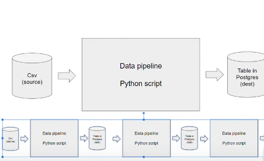

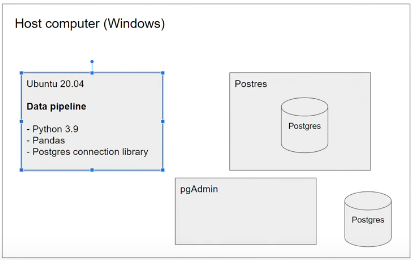

* You can have multiple container using postgres and the databases in each container do not know from each other, will not interfere with each other
* You don't need to install the software in your host computer, but only docker
* Docker helps to make your work distributionable, you can run the docker image in a different environment (e.g. in Google Cloud (kubernetes), AWS Batch)

## Why should we care about Docker?
* Reproducibality
* Local Experiments
* Integration tests (CI/CD, use e.g. github actions, not covered in this course)
* Running pipelines on the cloud (AWS Batch, Kubernetes jobs)
* Spark (for defining data pipelines)
* Serverless (usefull for processing data, one record at a time; AWS Lamda, Google functions)

## Examples using Docker

* docker run -it ubuntu bash
    * runs the image ubuntu in an interactive mode and executes the bash
* docker run -it python:3.9
    * starts the image python 3.9
    * can be used for python
* docker run -it --entrypoint=bash python:3.9
    * same as previous, but now starts with the bash
    * can e.g. be used to install packages
    * we can then start python with the command "python"
    * Problem: When we install a package here and exit the container, the next time we run it, the package will not be installed
* In the Dockerfile we can specify all the things we want to have in our container
* Build the image from a Dockerfile using ```docker build```:
    * ```docker build -t test:pandas .```
    * the ```.``` means that the container should be build in this folder
* After building the image you can run it:
    * ```docker run -it test:pandas```
* To run the example pipeline with the "day" argument:
   * ```docker run -it test:pandas 2023-01-13```
   * what comes after the image is passed as an argument

## Practice SQL with postgres

* run postgres in Docker
* put some data to postgres with a python script
* Use official docker image for postgres
	* postgres needs some configurations:
	```docker run -it \
           -e POSTGRES_USER="root" \     # environmental configurations
           -e POSTGRES_PASSWORD="root" \
           -e POSTGRES_DB="ny_taxi" \     # name of the database
           -v $(pwd)/ny_taxi_postgres_data:/var/lib/postgresql/data:rw # mount a volume: possibility to map a folder we have on the host machine to our container
           -p 5432:5432 \  # specify the port, map a port on our host machine to a port of the conatiner
                           # For databases we will send SQL request and the database needs to reply
         postgres:13```
* Using the volume allows us to preserve the changes in our database, i.e. they are not deleted, when we stop the container
* After running the container postgres constructed some files in "ny_taxi_postgres_data"
* We can start using ist now!
* pipcli is used as a client
* Using pgcli to connect to postgres
	```pgcli -h localhost -p 5432 -U root -d ny_taxi```
	* -p: port, -U: user, -d: database
* Stop the postgres service: ```sudo service postgresql stop```
* To test the connection type ```\dt``` int the terminal. This won't show any tables, since our database is still empty.

## Have a look at the Dataset
* Download the data and upload it to the database.
    * Data source: Data source: https://www.nyc.gov/site/tlc/about/tlc-trip-record-data.page
* Use python to read the dataset and upload it as databse
    * Data upload: upload-data.ipynb / upload-data-parquet.ipynp (for parquet data)
* Use ```SELECT count(1) FROM yellow_taxi_data``` to check the length of the databse
* Use ```\dt``` to get an overview about the databeses that we have
* After uploading the data ```\dt``` shows us the created table
* More exploration in pgcli, e.g.
    * ```SELECT max(tpep_pickup_datetime), min(tpep_pickup_datetime), max(total_amount) FROM yellow_taxi_data```

## Use a Jupyter Notebook to check the connection to the database
* As an alternative to pgcli, we can use a jupyter notebook to check the connection to the database (check.conection.ipynb)

## Use pgAdmin
* pgcli is a commant line interface for a quick look at the data, but not very comfortable
* Use webapplication pgAdmin
	* pgAdmin: feature rich Open Source administration and development platform for PostgreSQL
* Use Docker image to use pgAdmin:
	```docker run -it \
           -e PGADMIN_DEFAULT_EMAIL="admin@admin.com" \
           -e PGADMIN_DEFAULT_PASSWORD="root" \
           -p 8080:80 \
           dpage/pgadmin4
	```
* We now have 2 container: 1 for postgres and 1 for pgadmin4. We need to connect them
	* 1. Create a network: ```docker create pg-network```
	* 2. When we run postgres, we have to specify that this container runs in this network 
	   ```docker run -it \
           -e POSTGRES_USER="root" \     # environmental configurations
           -e POSTGRES_PASSWORD="root" \
           -e POSTGRES_DB="ny_taxi \     # name of the database
           -v ny_taxi_postgres_data:"./ny_taxi_postgres_data:/var/lib/postgresql/data:rw" # mount a volume: possibility to map a folder we have on the host machine to our container
           -p 5432:5432 \ # specify the port, map a port on our host machine to a port of the conatiner
                          # For databases we will send SQL request and the database needs to reply
           --network=pgnetwork
           --name pg database
           postgres:13```
	* 3. run pgAdmin in the same network
	 	```docker run -it \
                   -e PGADMIN_DEFAULT_EMAIL="admin@admin.com" \
                   -e PGADMIN_DEFAULT_PASSWORD="root" \
                   -p 8080:80 \
                   --network=pg-network \
                   --name=admin
                   dpage/pgadmin4 
                ```
* Now go to "localhost:8080" in the browser
	* pgadmin should open
	* Login with: email: admin@admin.com, password: root
	* Create a new server:
		* On the left hand side make right click on server -> create -> server
		* make the following specifications:

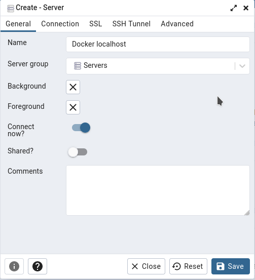
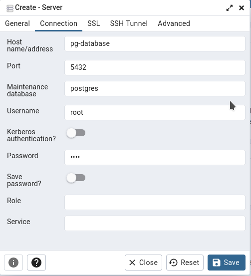

* press "save", the it should look like this:

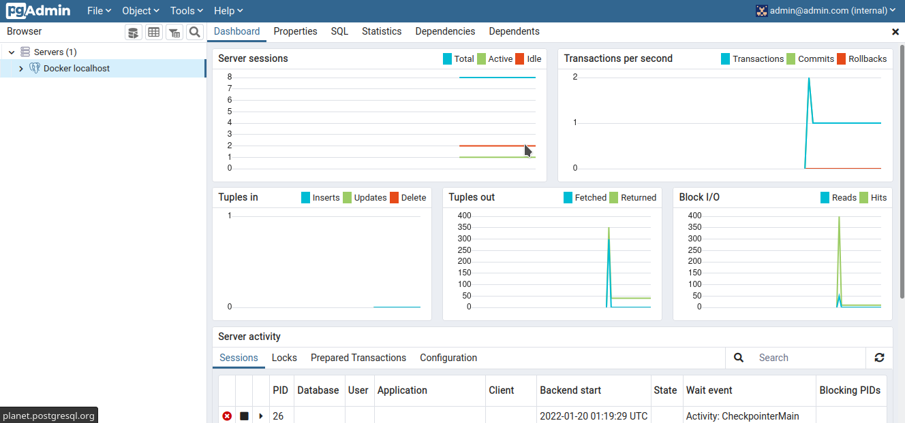

* Now we can navigate to our data on the left hand side:

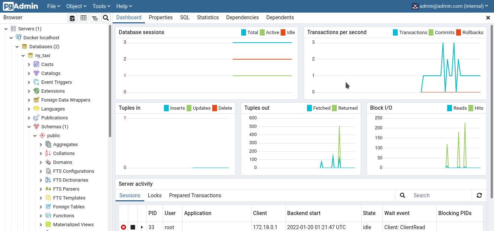
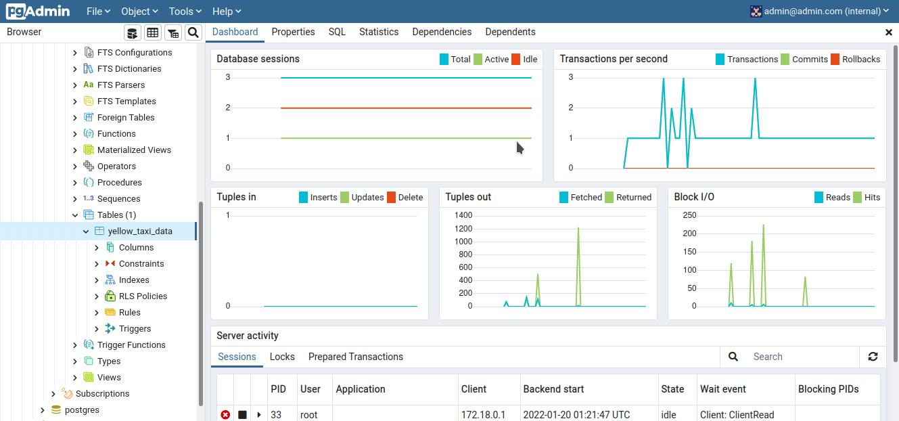

* For example we can have a look at the first 100 rows:

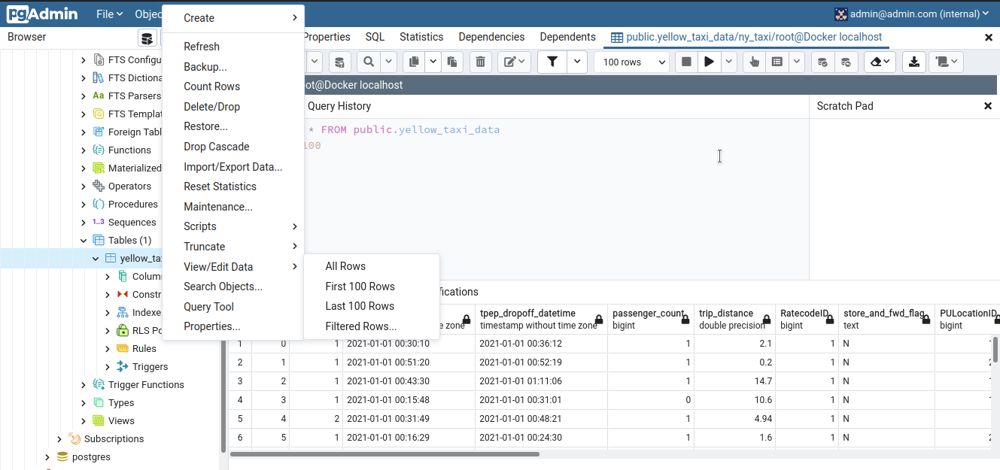

* We can use the "Query Tool" to write queries:


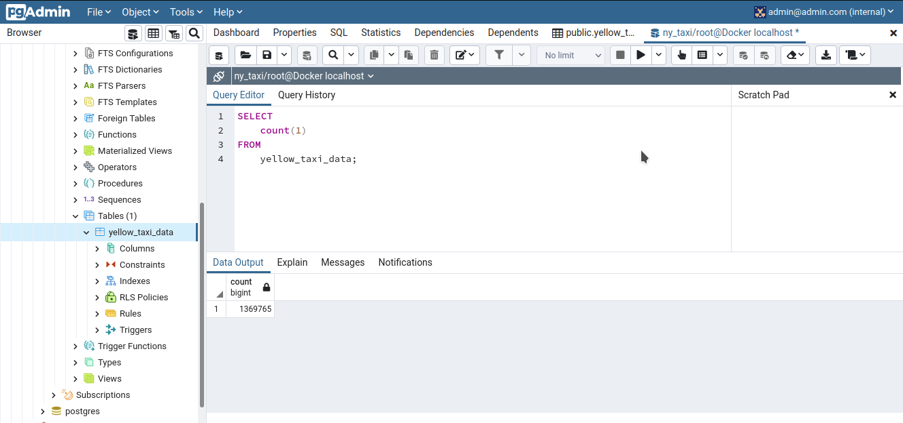

## Put Commands from the Notebook to a Script 

* put the commands from the jupyter notebook into a script called pipeline.py
* In order to do that use jupyter:
	```jupyter nbconvert --to=script upload-data.ipynb```
* Rename script to "ingest_data.py"
	* Clean the script
	* Add argparse and change specific names with parameters
* run the script:
	```
	URL="https://s3.amazonaws.com/nyc-tlc/trip+data/yellow_tripdata_2021-01.csv"
	python ingest_data.py \
	--user=root \
	--password=root \
	--host=localhost \
	--port=5432 \
	--db=ny_taxi \
	--table_name=yellow_taxi_trips \
	--url=${URL}
	```

## Now use this in Docker
* write Dockerfile
* Build the image: ```docker build -t taxi_ingest:001 .```
* Run it:
	``` 
	docker run -it \ 
	--network=pg-network \
	taxi_ingest:001 \
	--user=root \
	--password=root \
	--host=pg-database \
	--port=5432 \
	--db=ny_taxi \
	--table_name=yellow_taxi_trips \
	--url=${URL}
	```

## Docker compose
* Specify 1 yaml file with configurations of the two above container
* In general the configurations of multiple configurations are put in one file
```
services:
  pgdatabase:
    image: postgres:13
    environment:
      - POSTGRES_USER=root
      - POSTGRES_PASSWORD=root
      - POSTGRES_DB=ny_taxi
    volumes:
      - "./ny_taxi_postgres_data:/var/lib/postgresql/data:rw" # host path:container path:mode(read-write)
    ports:
      - "5432:5432" # local port:container port
  pgadmin:
    image: dpage/pgadmin4
    environment:
      - PGADMIN_DEFAULT_EMAIL=admin@admin.com
      - PGADMIN_DEFAULT_PASSWORD=root
    ports:
      - "8080:80"
```
* The two containers are then automatically part of one network
* Run ```docker-compose up``` in the terminal
* Run ```docker-compose down``` to end it
* It can be run in detached mode, i.e. after execution, we can use the terminal : ```docker-compose up -d```

## SQL
* data: https://www.nyc.gov/site/tlc/about/tlc-trip-record-data.page
* upload the data to postgres: upload-taxi-zone-data.ipynb
* call the table "zones"
* When running docker-compose, we can select the "Query" tool and use SQL queries to access the data, e.g.:
```SELECT * FROM zones; 

# Terraform
* What is Terraform?
	* open source by HashiCorp
	* used for provisioning infrastructure (e.g. virtual machines, storage, networking resources, ...) resources
	* Provides a consistent CLI workflow to manage hundreds of cloud services  
	* Supports DevOps best practices, with IaC approach
	* Manages configuration files in source control to maintain an ideal provisioning state for testing and production environments
* What is IaC
	* Infrastructure-as-code
	* A framework, that allows you to build, change, and manage your infrastructure in a safe, consistent and repeatable way by defining resource configurations that you can version, reuse, and share
	* As a git version control, but for infrastructure
* Some Advantages
	* Infrastructure lifecycle management
	* version control commits
	* Very usefull for stack-based deployments, and with cloud providers such as AWS, GCP, Azure, K8S,...
	* State-based approach to track resource changes throughout deployments

## Local Setup for Terraform and GCP
### Terraform 
* Installation: [https://www.terraform.io/downloads](https://www.terraform.io/downloads)

### GCP

For this course the free version (up to 300 Euro credis) is used.

1. Create an account with your Google E-mail ID
2. Setup your first project, e.g. "DTC DE Course", and note down the project ID
	* Make the project ID unique
	* The project ID can be changed py pressing the refresh button
	* Go to this project
	* Go to IAM & Admin -> Service Accounts
	* "Service Accounts" is an account for services

3. Setup service account & authentification for this project, and downloaded auth-keys:
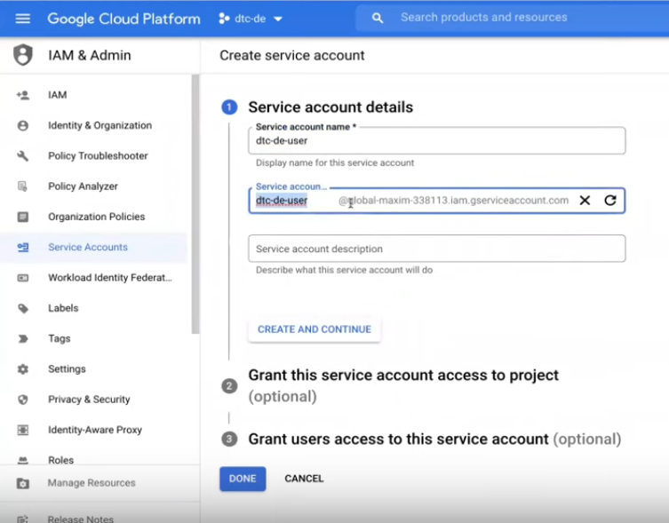

	* Use role "Viewer" to begin
	* When pressing "done":

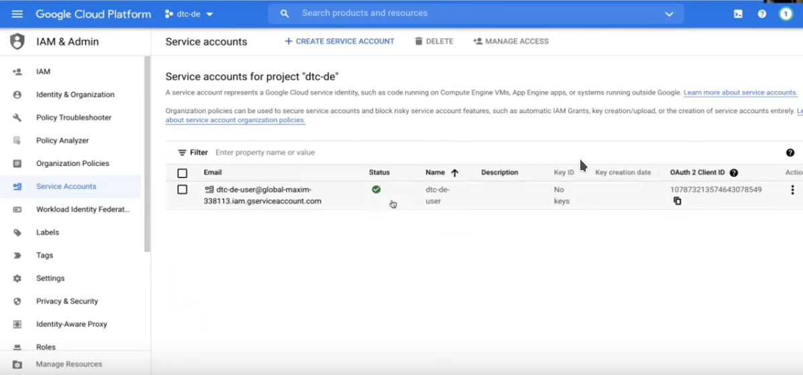

	* There are no keys generated yet
	* Go to actions -> Manage keys -> ADD KEY
	* keep json
	* Download the generated .json
4. Download SDK for local setup
	* Check if gcloud is already installed: ```gcloud -v```
	* If not install it: [SDK](cloud.google.com/sdk/docs/quickstart)
5. Set environment variable to point to your downloaded GCP auth-keys:
	* Go to the folder containing the downloaded key

	```
	export GOOGLE_APPLICATION_CREDENTIALS="<path/to/your/service-account-authkeys>.json"

	# Refresh token, and verfy authetification
	gcloud auth application-default login
	```

	* This is need, so that Google knows that is is your key
	* This will open the browser to authenticate

When this is done the local computer can interact with the cloud!

## Exercise
### Create infrastructure for our project with Terraform

Create two resourses in the Google environment: 
**Project infrastructure for our project with Terraform**
* Google Cloud Storage (GCS): Data Lake
	* In a "Data Lake" all the raw data is stored
	* In an organized way
* BigQuery: Data Warehouse
	* Data is more structured (e.g. tables,...)

Add permissions for your service account
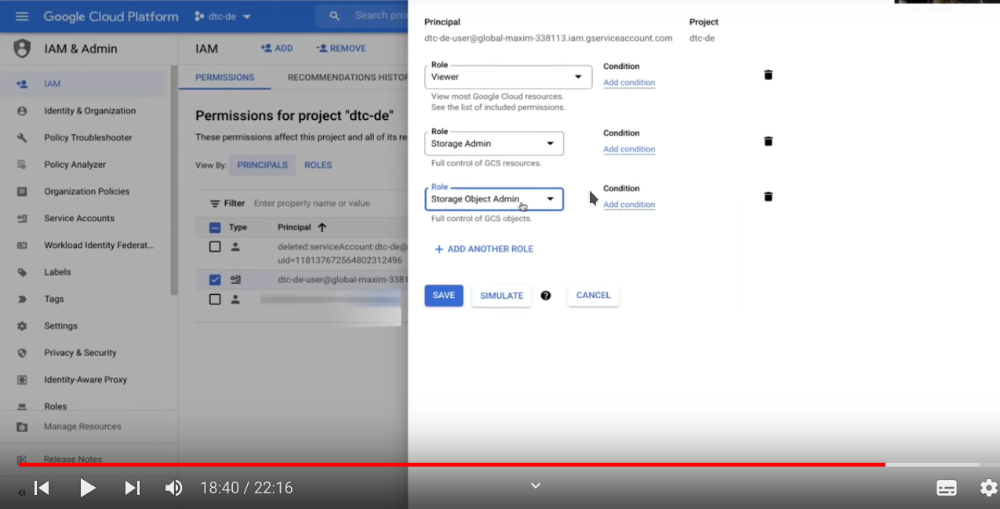

* In a real production these permissions would be restricted to a particular bucket
* In production the roles will be customized
* enable API to interact between local environment and the cloud environment
	* https://console.cloud.google.com/apis/library/iam.googleapis.com
	* https://console.cloud.google.com/apis/library/iamcredentials.googleapis.com

# Creating GCP Structure with Terraform

* How to define resources in terraform?
	* main.tf
	* to start, you need a terraform resource (terraform {}), which contains:
		* terraform version
		* backend, in this example "local", in prduction you use your cloud environment
		* required prividers, this is optional (think of it as in Python importing a library)
	* provider section
		* terraform relies on pluggins called providers, to interact with cloud providers
		* adds a set of predefined resourse data sources
	* resource
		* contains arguments to configure the resource
	* the main.tf file contains variables from the variables.tf file, written as "var."
		* variables.tf
			* contains "locals", which are constants
			* variables are generally passed at run-time
			* variables that contain "default" are optional run-time variables
			* variables without "default" are mandantory
* Terraform has only few execution commands:
	1. terraform init: initialize and install
	2. terraform plan: Match changes against the prviouos state (if you e.g. add another resource)
	3. terraform apply: Apply changes to the cloud
	4. terraform destroy: Remove your stack from the cloud (usually it is advisable to destroy your resourses, until you need them next time)
		* The next time you use "terraform apply" you will have back your state
		* This is a great advantage of using terraform, which has a state file
* After running "terraform init" some more files are in the folder
	* .terraform: like any package manager, manages all packages
	* .terraform-version
	* .terraform-lock.hcl 
* When running "terraform plan" you need to type the project id, because this is a variable where no default was set
	* ```terraform plan -var="project=<project-id>"```
* Then two new resources are created
	* BigQuery
	* Bucket
* Then in "terraform apply" you have to confirm the changes and then the new resources are created
	* To confirm: 1. type the project id,, 2. type "yes" 
