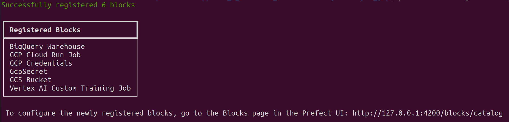

# Data Lake

## What is a Data Lake?

* holds big data from many sources
* data can be structured, semi-structured or unstructured
* idea: ingest data as quickly as possible and make it accessable to other team members
* has to be secure and scalable, inexpensive hardware

## Data Lake vs. Data Warehouse

* Data Lake:
	* generally unstructered data
	* target users: Data Scintists, Data Analysts, ...
	* stores huge amount of data
	* use cases: stream processing, ML, real-time analytics
* Data Warehouse:
	* data is generally structured
	* target users: Business Analysts
	* small data size
	* use cases: batch processing, (...)

## How did Data Lakes started?
* companies realized the value of data
* store and access quickly
* cannot always define structured data
* usefulness of data being realized later in the project lifecycle
* increase in Data Scientists
* R&D on data products
* need for cheap storage of big data

## ETL vs. ELT
* ETL: Export Transform and Load (Data Warehouse solution)
* ELT: Export Load and Transform (Data Lake solution)
* ETL is mainly used for a small amount of data, whereas ELT is used for large amounts of data
* ELT provides data lake support

## Gotcha of Data Lake
* converting into Data Swamp (-> makes it hard to be useful for e.g. Data Scientists)
* no versioning
* incompatible schemas for same data without versioning
* no metadata associated
* joins not possible

## Cloud provider Data Lake
* GPC - cloud storage
* AWS - S3
* AZURE - AZURE BLOB

# Introduction to Workflow Orchestration
* workflow orchestration means governing the dataflow in a way that respects orchestration rules and business logic
* dataflow binds otherwise dispared set of applications together
* workflow orchestration allows to turn any code into a scheduled workflow, that can be run and observed
* core features of workflow orchestration:
	* remote execution
	* scheduling	
	* retries
	* caching
	* integration with external systems (APIs, databases)
	* ad-hoc runs
	* parametrization
	* alert, when something fails

# Introduction to Prefect
## Use case: python script that pulls yellow taxi data into a postgres db 
* 'de-zoomcamp/week_2_workflow_orchestration/videos/ingest_data.py'
* create a conda environment: ```conda create -n zoom python=3.9``` and activate it ```conda activate zoom```
* install dependencies: ```pip install -r requirements.txt```
* run docker-compose.yaml file from week1 (week_1_basics_n_setup/videos/2_docker_sql/docker_postgres): ```docker-compose up```	and then ```python ingest_data.py```
* now we can go to ```localhost:8080``` and log into pgadmin
* create a new server: name "Docker localhost", port: "5432", host: "pgdatabase"

## Next: run the script on a schedule
* transform the script into a prefect flow: ```ingest_data_flow.py```
* flow:
	* most basic prefect object
	* container for workflow logic
	* allows to interact with the other workflow
* make needed imports:```from prefect import flow, task```
* define a new function called ```main_flow```, here the variables are set and the ```ingest_data``` function is called
* turn this into a prefect flow, by decorating it with ```@flow```
* flows can take tasks, we then transform the ```ingest_data``` function into a task by decorating it with ```@task```
* transform the script to ETL	
	* that is reorganize it in 3 functions for extracting, transforming and loading
* we can paramterize the flow, i.e. give the parameters to the flow instead of defining them inside, e.g. "table_name"
* a flow can have subflows (e.g. "log_subflow")
* we can use prefect ui to visualize the flows
	* open a new terminal and type ```prefect orion start```
	* to be sure to point to the correct API: ```prefect config set PREFECT_API_URL=http://127.0.0.1:4200/api```
	* browse to localhost:4200 to the the flows and tasks in the ui
* Blocks:
	* enable storage of configuration and provides an interface for interacting with the external system
	* several different types of blocks you can build, e.g. run infrastructure, credentials, read / write paths, GCS
	* can create your own blocks aswell				
	* different blocks can build upon each other, e.g. a credential block can be used in a bucket block
* Transform our credentials (user, password, etc.) into a SQL Alchemy block
	* prefect SQLAlquemy is already installed
	* see documentation: prefecthq.github.io/prefect-sqlalchemy
	* to register the block: ```prefect block register -m prefect_sqlalchemy``` (necessary if not shown in the ui)
	* the block we use is called ```SQLAlchemy Connector``` in the ui
	* click on "add"
	* give the block a name: "postgres-connector"
	* use "SyncDriver", choose "postgresql+psycopg2"
	* set the name of the db (according to what we chose in the python script) "ny_taxi", username: "root", password: "root", host: "localhost", port: 5432	
	* press "create"
	* Now, import this to our script ```from prefect_sqlalchemy import SqlAlchemyConnector```
	* adapt the script accordingly to load the data
	* blocks can also be added using code (see documentation)

## ETL with GCP & Prefect
	
* Start prefect webui: ```prefect orion start```
* Create folder "O2_gcp". We will work in this folder now
* Create file ```etl_web_to_gcs.py```
* Create a main flow-function, that will execute several tasks
	* this will do the following: take data from the web, clean the data, save as .parquet in our data lake in Google Cloud Storage
	* task fetch: reads the data from the web and stores it as pandas dataframe
		* set retries to 3. In case something fails the task will retry 3 times to execute.
	  	* this can be tested by uncommenting the ```if```-statement
	* task clean: cleans the data by fixing some type issues of the downloaded data
	* task write_local: writes the cleaned data to a local folder
	* task write_gcs: write the local parquet file to Google Cloud Storage
* Create a Google Cloud Storage Bucket
	* Login to Google Cloud and click on "console"
	* On the left-hand menu choose "Cloud Storage" -> "CREATE"
	* Choose a name and leave the rest on default
* Go to prefect webui and choose "Block"
	* with aBlock we can re-use configurations in a secure way
	* register the gcp blocks we need: 
		* in the terminal: ```prefect block register -m prefect_gcp```
		* the output looks like this:
			
	* In webui add "GCS Bucket"
	
	* give it a name and fill in the name of the created Bucket on GCP
	* Add credentials (by clicking on "Add+" below Gcp Credentials) (thisis optional)
	* this directs us to create a new GCP credentials Block
		* give it a name
		* to get the service account, go to GCP, on the left-hand side menu select "IAM & Admin" -> "Service Accounts"
		* press "CREATE SERVICE ACCOUNT"
		* give it a name
		* click "CREATE AND CONTINUE"
		* select a role: "BigQuery Admin", "Storage Admin"
		* click "done"
		* now we need to give it keys: click on "manage keys", "CREATE A NEW KEY" in .json format
		* the content of this file can be copied to the prefect block
	* then the credentials block can be added
	* the GCS Bucket block can now be created
	* this gives us a code snippet, which we can use:
	```from prefect_gcp.cloud_storage import GcsBucket
gcp_cloud_storage_bucket_block = GcsBucket.load("zoom-gcs")```
* Now we can run the script and the data is uploaded

## From Google Cloud Storage to Big Query

* Now we want to move our data to the data warehouse: file: etl_gcs_to_bg.py
* import additionally GcpCredentials, which we will use to write data to Big Query 
* task extract_from_gcs: downloads data from GCS to a local folder
	* ```get_directory``` Downloads a directory from a given remote path to a local directory.
* task transform: makes some data transformations
* task write_bq: write data to Big Query
	* Setup Big Query:
		* In Google Cloud, on the left hand menu select "Big Query"
		* Select "ADD DATA", choose the data source. Since we have data on Google Cloud Storage, we choose this.
		* "Select file from GCS bucket" -> browse to yellow taxi data
		* create a "Dataset" (give it a name, e.g. "dezoomcamp" and create it)
		* give the "Table" a name
		* leave the rest as it is and create the table
		* if you go to the table you can query things directly there by going to "QUERY"
	 	* delete all data with ```DELETE FROM `stoked-mode-375206.dezoomcamp.rides` WHERE true```, to simulate that we write it with our python script
	* we use ```df.to_gbq``` to write the data to big query
	* the credentials we give there, to access it we already created in a prefect block. We can use the code snipped given in the prefect ui.
	```from prefect_gcp import GcpCredentials
gcp_credentials_block = GcpCredentials.load("zoom-gcp-creds")```

### Parametrizing Flow & Deployments with ETL into GCS flow
* extend on ```01_start/ingest_data_flow.py```, save it as ```parameterized_flow.py```
* paramterization means allowing the flow to take parameters
* create a parent flow for the flow ```etl_web_to_gcs```, that triggers the flow several times
* add a cache to the task ```fetch```, that ensures the task is cached for 1 day by adding ```cache_key_fn=task_input_hash, cache_expiration=timedelta(days=1)``` (this is done for not having to read the data in again, when it is in the cache)
* run ```prefect orion start``` and run the flow: ```python3 parameterized_flow.py```, activate "SQLAlchemyConnector"
* Until now: we have run the flows from the terminal. Now: we want to create a deployment.

**Create a prefect deployment:**
* to trigger and schedule flow runs
* Deployment: Server side concept, that encapsulates a flow, allowing it to be scheduled and triggered via the API
* Documentation: https://docs.prefect.io/concepts/deployments/

* Two ways to build a deployment:
	1. Through cli (-> now)
	2. Using Python (-> later) 
* In the terminal run ```prefect deployment build <filename>:<entrypoint_to_flow> -n "Parameterized ETL", in this example:
```prefect deployment build parameterized_flow.py:etl_parent_flow -n "Parameterized ETL"
* This builds the deployment and creates a ```<entrypoint_to_flow>-deploymentyaml (```etl_parent_flow-deployment.yaml```)-file in the same directory
* This is all the metadata the deployment needs to know
	* There we can add our parameters: ```parameters: { color: "yellow", "months": [1,2,3], "year": 2021 }```
* To apply the deployment: ```prefect deployment apply etl_parent_flow-deployment.yaml```
* We now have a deployment created, this is also visible in the ui
	* In the ui we can click on "Deployments" and then on our created deployment
	* We can add a description and see the paramters we set
* To start the deployment, we need an agent
* The agent is pulling from a work queue
	* In the ui click on "Work Queue", "default"
	* This shows us how to start an agent from the terminal: ```prefect agent start  --work-queue "default"```
* Then start a deployment directly by clicking on "Deployment", <name-of-the-deployment>, "RUN", "Quick run"

**Set a Notification:**
* In the ui click on "Notification", "create notification"
* Select a state, when you want to be notified, optionally a tag can be added
* E.g. a Slack Webhook can be created, then you will get a notification in slack

