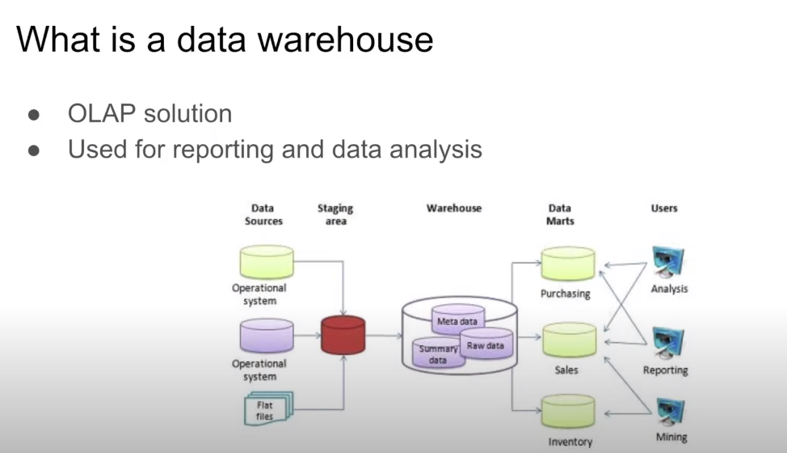

## Data Warehouse

* Big Query is used as example

**Content:**
* OLAP vs OLTP
* What is a data warehouse
* BigQuery
	* Costs
	* Partitions and Clustering
	* Best Practices
	* Internals
	* ML in BQ

### OLAP vs OLTP

**OLTP:** Online Transfer Processing
**OLAP:** Online Analytical Processing


### What is a data warehouse?

* A data warehouse is an OLAP solution
* It is used for reporting and data analysis
* In general consists of raw data, meta data and summary data
* In general has different data sources
* Can be converted into Data Marts, which can be directly accessed by users



### BigQuery

* Serverless data warehouse
	* There are no servers to manage or database software to install
* Software as well as infrastructure including
	* Scalable and high-availability
* Built-in features like
	* Machine Learning
	* Geospatial Analysis
	* Nusiness Intelligence
* BigQuery maximize flexibility by separating the compute engine that analyzes your data from your storage

* BigQuery provides a lot of open source public data
	* You can search for this data in the web ui
* We can use SQL to query the data and save the results as csv

#### Costs:
* On demand pricing: 
	* 1TB of data processed is $5
* Flat rate procing
	* Based on number of pre requested slots
	* 100 slots -> $2,000/month = 400TB data processed on demand pricing

#### Partitions and Clustering

* Partitioning can improve BigQuery performance
* E.g. partitioning on date
	* If we want to read the data for a specific date, the other dates, not in that partition will not be read
* Helps to improve costs
* Partitioning on date using SQL:
``` 
CREATE OR REPLACE TABLE taxi-rides-ny.nytaxi.yellow_tripdata_partitioned
PARTITION BY
	DATE(tpep_pickup) AS
SELECT * FROM taxi-rides-ny.nytaxi.external_yellow_tripdata;
```  
* Additionally to partitioning we can cluster by other columns

```
CREATE OR REPLACE TABLE taxi-rides-ny.nytaxi.yellow_tripdata_partitioned_clustered
PARTITIONED BY DATE(tpep_pickup_datetime)
CLUSTER BY VendorID AS
SELECT * FROM taxi-rides-ny.nytaxi.external_yellow_tripdata;
```

* When creating a partition in BigQuery, you can choose
	* A time-unit column
	* Ingestion time (PARTITIONTIME)
	* Integer range partitioning
	* When using time unit or ingestion time
		* Daily (default)
		* Hourly
		* Monthly or yearly
	* Number of partitions limit is 4000

* BigQuery Clustering
	* Columns you specify are used to colocate related data
	* Order of the columns is important
	* The order of the specified columns determines the sort order of the data
	* Clustering improves
		* Filter queries
		* Aggregate queries
	* Table with data size < 1GB, don't show signficant improvement with partitiong and clustering
	* You can specify up to four clustering columns
	* Clustering columns must be top-level, non-repeated columns
		* DATE
		* BOOL
		* GEOGRAPHY
		* INT 64
		* NUMERIC
		* BIGNUMERIC
		* STRING
		* TIMESTAMP
		* DATETIME


* When to prefer clustering over partitioning
	* Partitioning results in a small amount of data (approximately less than 1GB)
	* Partitioning results in a large number of partitions beyond the limits on partitioned tables
	* Partitioning results in your mutation operations modifying majority of partitions in the table frequently (for example every few minutes)

* Automated reclustering
	* As data is added to a clustered table
		* The newly inserted data can be written to blocks that contain key ranges that overlap with the key ranges in previsouly written blocks
		* These overlapping keys weaken the sort property of the tables
	* To maintain the performance characteristics of a clustered table
		* BigQuery performs automatic re-clustering in the backgound to restore the sort property of the table
		* For partitionen tables, clustering is maintained for data within the scope of each partition

#### Best Practices

* Cost reduction
	* Avoid ```SELECT *```
	* Price your queries before running them
	* Use clustered or partitioned tables
	* Use streaming inserts with caution
	* Materialize query results in stages

* Query performance
	* Filter on partitioned columns
	* Denormalize data
	* Use nested or repeated columns
	* Use external data sources appropriately
	* Don't use it in case you want a high query performanc
	* Reduce data befor using a ```JOIN```
	* Do not treat ```WITH``` clauses as prepared statements
	* Avoid oversharding tables
	* Avoid JavaScript user-defined functions
	* Use approxiate aggregation functions (HyperLogLog++)
	* Order last, for query operatios to maximize performance
	* Optimize your join patterns
	* As a best practice, place the table with the largest number of rows first, followed by the table with the fewest rows, and then place the remaining tables by decreasing size

#### Internals


#### ML in BQ

* Target audience  Data Analysts, managers
* No need for Python or Jva knowledge
* No need to export data into a different system
	* Usually, when training a ML model:
		* export the data from a data warehouse
		* build a model, train & deploy it
	* BigQuery allows to build the model in th edata warehouse itself
* Costs:
	* Free: 
		* 10 GB per month of data storage
		* 1 TB per month of queries processed
		* ML create model step: First 10 GB per month are free
	* After the free tier: 250$ per TB month for logistig regression, linear regression, k-means, time series and extra costs for other models (US)

* Steps in ML development:


* BigQuery helps in all these steps


### Example of ML in Big Query

* Choose columns of interest (data cleaning)
```
-- SELECT THE COLUMNS INTERESTED FOR YOU
SELECT passenger_count, trip_distance, PULocationID, DOLocationID, payment_type, fare_amount, tolls_amount, tip_amount
FROM `taxi-rides-ny.nytaxi.yellow_tripdata_partitoned` WHERE fare_amount != 0;
```
* Feature Engineering
	* Documentation: cloud.google.com/bigquery-ml/docs/reference/standard-sql/bigqueryml-auto-preprocessing
	* Change type of some features
```
 -- CREATE A ML TABLE WITH APPROPRIATE TYPE
CREATE OR REPLACE TABLE `taxi-rides-ny.nytaxi.yellow_tripdata_ml` (
`passenger_count` INTEGER,
`trip_distance` FLOAT64,
`PULocationID` STRING,
`DOLocationID` STRING,
`payment_type` STRING,
`fare_amount` FLOAT64,
`tolls_amount` FLOAT64,
`tip_amount` FLOAT64
) AS (
SELECT passenger_count, trip_distance, cast(PULocationID AS STRING), CAST(DOLocationID AS STRING),
CAST(payment_type AS STRING), fare_amount, tolls_amount, tip_amount
FROM `taxi-rides-ny.nytaxi.yellow_tripdata_partitoned` WHERE fare_amount != 0
);

``` 
* Create model
```
-- CREATE MODEL WITH DEFAULT SETTING
CREATE OR REPLACE MODEL `taxi-rides-ny.nytaxi.tip_model`
OPTIONS
(model_type='linear_reg',
input_label_cols=['tip_amount'],
DATA_SPLIT_METHOD='AUTO_SPLIT') AS
SELECT
*
FROM
`taxi-rides-ny.nytaxi.yellow_tripdata_ml`
WHERE
tip_amount IS NOT NULL; 
```	
* Have a look at the features
```
-- CHECK FEATURES
SELECT * FROM ML.FEATURE_INFO(MODEL `taxi-rides-ny.nytaxi.tip_model`);
```
	* This shows some statistics of the features

* Evaluate the model
```
-- EVALUATE THE MODEL
SELECT
*
FROM
ML.EVALUATE(MODEL `taxi-rides-ny.nytaxi.tip_model`,
(
SELECT
*
FROM
`taxi-rides-ny.nytaxi.yellow_tripdata_ml`
WHERE
tip_amount IS NOT NULL
));
```
* Make predictions
```
-- PREDICT THE MODEL
SELECT
*
FROM
ML.PREDICT(MODEL `taxi-rides-ny.nytaxi.tip_model`,
(
SELECT
*
FROM
`taxi-rides-ny.nytaxi.yellow_tripdata_ml`
WHERE
tip_amount IS NOT NULL
));
```

* Explain and predict shows the top three features used in the prediction
```
-- PREDICT AND EXPLAIN
SELECT
*
FROM
ML.EXPLAIN_PREDICT(MODEL `taxi-rides-ny.nytaxi.tip_model`,
(
SELECT
*
FROM
`taxi-rides-ny.nytaxi.yellow_tripdata_ml`
WHERE
tip_amount IS NOT NULL
), STRUCT(3 as top_k_features));
```
* Hyperparamter tuning
	* Documentation for hyperparameters: cloud.google.com/gigquery-ml/docs/referencs/standard-sql/bigquery-syntax-create-glm
```
- HYPER PARAM TUNNING
CREATE OR REPLACE MODEL `taxi-rides-ny.nytaxi.tip_hyperparam_model`
OPTIONS
(model_type='linear_reg',
input_label_cols=['tip_amount'],
DATA_SPLIT_METHOD='AUTO_SPLIT',
num_trials=5,
max_parallel_trials=2,
l1_reg=hparam_range(0, 20),
l2_reg=hparam_candidates([0, 0.1, 1, 10])) AS
SELECT
*
FROM
`taxi-rides-ny.nytaxi.yellow_tripdata_ml`
WHERE
tip_amount IS NOT NULL;
```

### Export the model

* Export the model made and check prediction by deploying it with a docker image
* Steps:
	* gcloud auth login
	* export project to google storage
		* ```bq --project_id taxi-rides-ny extract -m nytaxi.tip_model gs://taxi_ml_model/tip_model```
	* Make a directory ```mkdir /tmp/model``` 
	* Copy the model intothe new directory
		* ```gsutil cp -r gs://taxi_ml_model/tip_model /tmp/model```
	* Create a serving directory
		* ```mkdir -p serving_dir/tip_model/1```
	* Copy all the data into this directory
		* ```cp -r /tmp/model/tip_model/* serving_dir/tip_model/1``
	* Pull tensorflow serving docker image
		* ```docker pull tensorflow/serving``` 
	* Run the image
		* ```docker run -p 8501:8501 --mount type=bind,source=pwd/serving_dir/tip_model,target= /models/tip_model -e MODEL_NAME=tip_model -t tensorflow/serving &```
	* Make http request (alternatice use postman for this)	
		* ```curl -d '{"instances": [{"passenger_count":1, "trip_distance":12.2, "PULocationID":"193", "DOLocationID":"264", "payment_type":"2","fare_amount":20.4,"tolls_amount":0.0}]}' -X POST http://localhost:8501/v1/models/tip_model:predict```
	* http://localhost:8501/v1/models/tip_model
