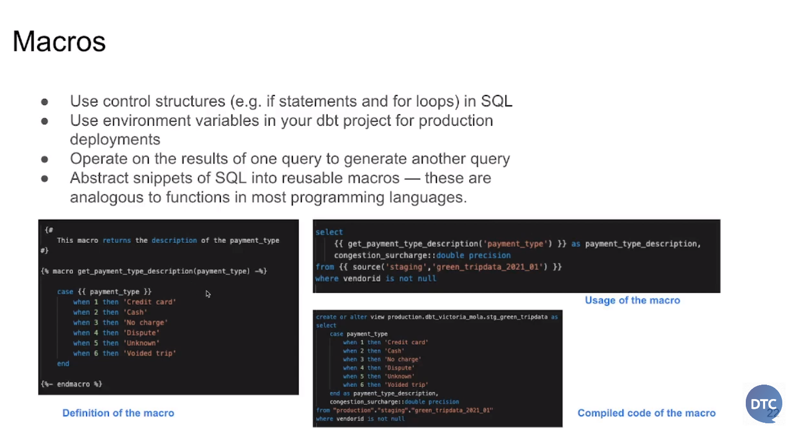

# Analytics Engineering

* Note: Check branch week 4 for dbt content

## What is Analytics Engineering?


* We will focus on
	* Data modelling
	* Data presentation

* Data modelling concepts
	* ETL vs ELT
		* In ETL the data is transformed before loading to the data warehouse
		* In ETL the data is tranformed in the data warehouse
		* ETL is more stable
		* ELT is faster and more flexible

	

	* Kimball's Dimensional Modeling:
		* Objective:
			* Deliver data, that is understandable to the business users
			* Deliver fast query performance

		* Approach:
			* Prioritise user understandability and query performance over non redundand data (3NF)
		* Other approaches:
			* Bill Inmon
			* Data vault
	* Elements of Dimensional Modeling
		* Facts tables
			* Measurements, metrics or facts
			* Corresponds to a business process
			* "verbs" (e.g. sales, orders)
		* Dimensions tables
			* Corresponds to a business entity
			* Provides context to a business process
			* "nouns" (e.g. customer, product)
		* Also known as star schema
	
		

	* Architecture of Dimensional Modeling
		* Stage Area
			* Contains the raw data
			* Not meant to be exposed to everyone
		
		* Processing area
			* From raw data to data models
			* Focuses in efficency
			* Ensuring standards
		
		* Presentation area
			* Final presentation of the data
			* Exposure to business stakeholder

		* Restaurant analogy:
			* Stage area: food is processed (limited to people who know how to do it)
			* Processing area: kitchen (limited to people who know how to do it)
			* Presentation area: Dining area (exposure)

## What is dbt?

* dbt is a transformation tool that allows anyone that knows SQL to deploy analytics code following software engineering best practices like modularity, partability, CI / CD, and documentation.


* dbt workflow
	* develop models
	* test and document them
	* deployment phase (version control and CI / CD)


* How does dbt work?	
	* Add modeling layer to our data, where the data is transformed
	* The transformed data is persist back to the data warehouse
	* The transformation is doen with SQL, which are our dbt models
	* dbt compiles the code and pushes to the data warehouse
	

## How to use dbt?

* dbt Core
	* Open source project, that allows data transformations
	* Builds and runs a dbt project (.sql, and .yml files)
	* Includes a CLI interface to run dbt commands locally
	* Opens source and free to use
* dbt Cloud
	* SaaS application to develop and manage dbt projects
	* Web-based IDE to develop, run and test a dbt project
	* Jobs orchestration
	* Logging and alerting
	* Integrated documentation 
	* Free for individuals (one developer seat)

## How are we going to use dbt?

* BigQuery
	* Development using cloud IDE
	* No local installatio of dbt core
* Postgres
	* Development using a local IDE of your choice
	* Local installation of dbt core connecting to the Postgres database
	* Running dbt models through the CLI
	

## Starting a dbt projecti: BigQuery
* dbt provides a starter project with all the basic folders and files.
* There are essentially two ways to use it:
	* With the CLI
		* After having installed dbt loacally and setup the profiles.yml, run ```dbt_init``` in the path we want to start the project to clone the starter project
	* With dbt cloud
		* After having set up dbt cloud credentials (repo and dwh) we can start the project from the web-based IDE
			
* Upload needed data (if not already done)
	* In case data is missing here is a script for uploading https://github.com/DataTalksClub/data-engineering-zoomcamp/blob/main/week_3_data_warehouse/extras/web_to_gcs.py
* In Google BigQuery create two new tables (schemas) in our project: "dbt-some-name" (for development), "production" (for production)
* Make a dbt-cloud account and connect to BigQuery: https://www.getdbt.com/signup/
* Create a service account for dbt in BigQuery following this instruction: https://github.com/froukje/data-engineering-zoomcamp/blob/main/week_4_analytics_engineering/dbt_cloud_setup.md
	* Note to add the dbt key to the github repo, go to your repo and click on settings in the top menu, not below your profile
* Create a new branch on github 
* After finishing the setup go to "Develop" in the dbt cloud
* Switch to the new branch 
* Initialize the project by clicking the button
* This creates several folders and files
* Open the dbt_project.yml
	* Change the name to e.g. "taxi_rides_ny"
	* Change "models" to "taxi_rides_ny"
	* Delete the last to rows "example ...", we are not using this here

## Starting a dbt Project locally (alternative)
* As an alternative to the cloud, that require to have a cloud database, you will be able to run the project installing dbt locally. 
* https://docs.getdbt.com/docs/get-started/installation or use a docker image from https://github.com/dbt-labs/dbt-core
* Create a repository on github
* Create a file called ```profiles.yml``` to define the connection to the database
```pg-dbt-workshop
     target: dev
     outputs:
       dev:
         type: postgres
	 host: localhost
	 user: my_user
	 password: my_password
	 port: 5432
	 dbname: production
	 schema: dbt_victoria_mola
	 threads: 4
	 keepalives_idle: 0 # default 0, indicatiting the system default
  pg-de-zoomcamp
    target: dev
    outputs:
      dev:
        type: bigquery
        method: service-account
        project: taxi-rides-ny
        dataset: dbt_frauke
	threads: 4
	keafile: my_key_file.json```
* This file is stored outside of the project in the home directory: ```.dbt/profiles.yml```
* Move to repository and initialize the repository: ```dbt init```
* This creates a new folder, which is the project,name it e.g. "taxi_rides_ny"
* In this folder several files are created
	* dbt_project.yml needs to be adapted and change ```profile``` to the profile name we created in the ```profiles.yml```
* We can use ```dbt debug``` to check our connection

## Development of dbt Models

* We can use SQL and Jinja for the model
* Inside a Junja block we can use functions (macros)
	* At the beginning of a model usually the ```config``` macro is used
	* In the example below we work with the "materialization strategy" ```table```, other provided startegies are ```View```, ```Incremental```, and ```Ephemeral``` 
	* Using this materialization strategy will drop the table, if it already exists and create a table in the schema we are working with, with the name of the model (filename), in the example ```my_model```
	


* The model is translated to a ```SELECT``` statement
* The ```FROM``` clause in this statement is defined by the the Jinja-macro called ```source```
* The sources can be defined in a .yml-file
* Data can also be read from a .csv-file ("Seeds")
* This .csv-file is stored in our repository 


* Move to the console and create our own model: https://cloud.getdbt.com/
* Create two more folder s inthe "models" folder: "staging" (for raw models), "core" (for models that are at the end exposed)
* Create a first model under "staging":
	* ```stg_green_tripdata.sql```
	* We are using a "view" (not a "table"), so that we don't have to refresh them constantly but still have the latest data
	* We want to model the SQL-query: ```select * from stoked-mode-375206.dezoomcamp.rides_green```
	* For that we need to create a file ```schema.yml``` in the "staging" folder and define the source


* Run the model
	* At the bottom of the page is a field to write in: ```dtb run```
	* This runs all the models, that are defined
	


* Change the model:
```
{{ config(materialized='view') }}

select 
  --identifiers
  cast(vendorid as integer) as vendorid,
  cast(ratecodeid as integer) as ratecodeid,
  cast(pulocationid as integer) as pickup_locationid,
  cast(dolocationid as integer) as dropoff_locationid,
  --timestamps
  cast(lpep_pickup_datetime as timestamp) as pickup_datetime,
  cast(lpep_dropoff_datetime as timestamp) as dropoff_datetime,
  --trip info
  store_and_fwd_flag,
  cast(passenger_count as integer) as passenger_count,
  cast(trip_distance as numeric) as trip_distance,
  cast(trip_type as integer) as trip_type,
  --payment info
  cast(fare_amount as numeric) as fare_amount,
  cast(extra as numeric) as extra
  cast(mta_tax as numeric) as mta_tax,
  cast(tip_amount as numeric) as tip_amount,
  cast(tolls_amount as numeric) as tolls_amount,
  cast(improvement_surchagrge as numeric) as improvement_surchagrge,
  cast(total_amount as numeric) as total_amount,
  cast(payment_type as integer) as payment_type,
  cast(congestion_surcharge as numeric) as congestion_surcharge

from {{ source('staging', 'rides_green') }}
limit 100
```
* To run jus one file we can use ```dbt run --select stg_green_tripdata```
* In BigQuery we can now see our reated table (called (```stg_green_tripdata```)

### Macros
* What are macros?
	* Macros are similar to functions, but return code



* Create a macro in the project
	* In the folder "macros" create a new file called "get_payment_type_description.sql"

```
{#
	This macro returns the description of the payment_type
#}


	
	case {{ payment_type }}
		when 1 then 'Credit card'
		when 2 then 'Cash'
		when 3 then 'No charge'
		when 4 then 'Dispute'
		when 5 then 'Unknown'
		when 6 then 'Voided trip'
	end


``` 

* Then we can call the macro in the ```stg_green_tripdata.sql``` file: ```{{ get_payment_type_description('payment_type') }} as payment_type_description```

* In dbt packages can be used
	* dbt projects with modules and macros, that can be used
	* Create a packages.yml file in the project, where all packages you want to used are listed


* In the project create a ```packages.yml``` file at the root of the repo with
```
packages:
  - package: dbt-labs/dbt_utils
    version: 0.8.0
``` 
* To install the packages, run in the field on the bottom of the page: ```dpt deps```
* Add it to the model: ```{{ dbt_utils.surrogate_key(['vendorid', 'lpep_pickup_datetime']) }} as tripid```

### Variables

* Can be used across the project


* Add a variable to the model, that defines whether a run is a test run or not to limit the data processed in tests
* At the end of the SQL statement: 
```
limit 100

```
* This can be run ```-- dbt build -f <model.sql> --var 'is_test_run: false'```

### A second model
* Create a second model for the yellow trip data

### dbt Seeds
* .csv-files, that we can have in our repo in the "Seeds" folder
* meant to be used for smaller files, that contain data that does not change very often
* To get the file into the dbt cloud, we need to upload it into the repo and pull from the dbt cloud or create the file directly there
* Create a file called ```taxi_zone_lookup.csv``` in the "Seeds" folder
* Run ```dbt seed```
* In our ```dbt_project.yml``` file add:
```
seeds:
  stoked-mode-375206:
    taxi_zone_lookup:
      + column_types:
	locationid: numeric
```
* Create a model based on this
	* Create a new file in "models/core" called ```dim_zones.sql```
	* This time we use a table
	* Create a model called ```fact_trips.sql``` to unify everything
