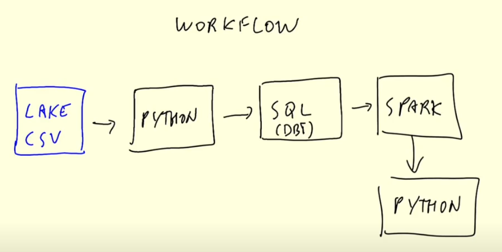

# Batch Processing

## Introduction to Batch processing

* Batch vs. streaming
	* Batch: processing a chunk of data at regular intervals (e.g. daily, weekly,...)
	* Streaming: Processing data on the fly
* Types of batch jobs
	* SQL, Python scripts, **Spark**, Flink
* Orchestrating batch jobs

* Advantages and disadvabtages of batch jobs
	* Advantages: easy to manage, retry, scale; easier to orchestrate
	* Delay

## Spark Introduction

* What is Spark?
	* Spark is a "general purpose distributed **engine**"
	* open-source unified analytics engine for large-scale data processing
	* multi-language engine (e.g. wrapper fpr Python: PySpark)
	* Common use cases: batch-type workloads. (Also streaming, but we won't cover this here) 
* Why do we need it?
	* For the same things as you'd use SQL, but for executing the queries on the files in your datalake
* If you can write this in SQL and use Hive/Presto/Athena/BQ- do it. But not everything can/should be expressed in SQL
* Common case: ML algorithms. You can easily use SQL for most of it
* Typical Pipeline;
	* Raw data -> Data lake -> SQL -> Spark -> Spark for applying the model -> SQL
	
	* All orchestrated with Airflow

## Installing Spark (Linux)

* Connecting to an instance on GCP and installing it there
* tested on Ubuntu 20.04
* Use the VM set up in week 1
* Start the VM and connect to it: ```ssh-i ~/.ssh/gcp froukje@external-ip```

## First look at Spark/PySpark

* Reading CSV files
* Partitions
* Saving data to Parquet for local experiments
* Spark master ui

## Spark DataFrames

* Actions vs transformations
* Partitions
* Functions and UDFs

## Spark SQL

* Temporary tables
* Some simple queries from week 4

## Joins in Spark

* Merge sort join
* Broadcasting

## RDDs

* From DF to RDD
* map
* reduce
* mapPartition
* From RDD to DF

## Spark Internals

* Driver, master and executors
* Partitioning & coalesce
* Shuffling
* Groupby or not groupby?
* Broadcasting

## Spark & Docker

## Running Spark in the Cloud (GCP)

* https://cloud.google.com/solutions/spark

## Connecting Spark to a DWH

* Spark with BigQuery (Athena/presto/hive/etc - similar)
* Reading from GCP and saving to BG

