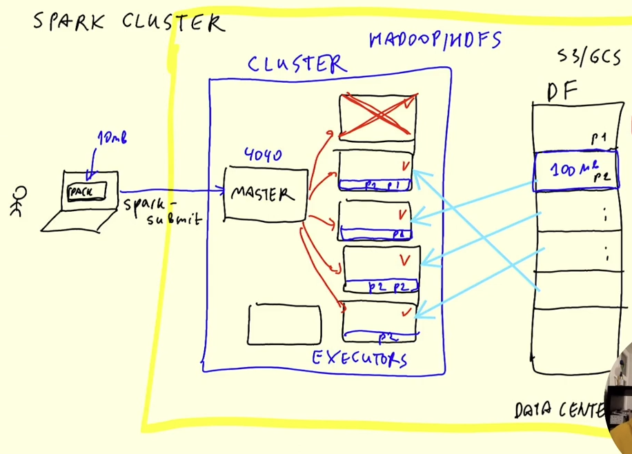

# Batch Processing

## Introduction to Batch processing

* Batch vs. streaming
	* Batch: processing a chunk of data at regular intervals (e.g. daily, weekly,...)
	* Streaming: Processing data on the fly
* Types of batch jobs
	* SQL, Python scripts, **Spark**, Flink
* Orchestrating batch jobs

* Advantages and disadvabtages of batch jobs
	* Advantages: easy to manage, retry, scale; easier to orchestrate
	* Delay

## Spark Introduction

* What is Spark?
	* Spark is a "general purpose distributed **engine**"
	* open-source unified analytics engine for large-scale data processing
	* multi-language engine (e.g. wrapper fpr Python: PySpark)
	* Common use cases: batch-type workloads. (Also streaming, but we won't cover this here) 
* Why do we need it?
	* For the same things as you'd use SQL, but for executing the queries on the files in your datalake
* If you can write this in SQL and use Hive/Presto/Athena/BQ- do it. But not everything can/should be expressed in SQL
* Common case: ML algorithms. You can easily use SQL for most of it
* Typical Pipeline;
	* Raw data -> Data lake -> SQL -> Spark -> Spark for applying the model -> SQL
	
	* All orchestrated with Airflow

## Installing Spark (Linux)

* Connecting to an instance on GCP and installing it there
* tested on Ubuntu 20.04
* Use the VM set up in week 1
* Start the VM and connect to it: ```ssh-i ~/.ssh/gcp froukje@external-ip```
* Install Java
	* To install Java we need a specific version of JDK (either 8 or 11)
	* Download from jdk.java.net/archive
	* Create a folder called "Spark" and download the file there```wget https://download.java.net/java/GA/jdk11/13/GPL/openjdk-11.0.1_linux-x64_bin.tar.gz```
	* Unpack it: ```tar xzvf openjdk-11.0.1_linux-x64_bin.tar.gz```
	* Create the variables: ```export JAVA_HOME="${HOME}/spark/jdk-11.0.1"``` and ```export PATH="${JAVA_HOME}/bin:${PATH}"```
* Install Spark
	* "spark.apache.org/downloads.html" select a release
	* ```wget https://dlcdn.apache.org/spark/spark-3.2.3/spark-3.2.3-bin-hadoop3.2.tgz```
	* ```tar xzfv spark-3.2.3-bin-hadoop3.2.tgz```
	* Do ```export SPARK_HOME="${HOME}/spark/spark-3.2.3-bin-hadoop3.2"``` and ```export PATH="${SPARK_HOME}/bin:${PATH}"```
	* run ```spark-shell``
	* To test, if everything is working run (in scala):
	```val data= 1 to 10000
	   val distData = sc.parallelize(data)
	   distData.filter(_ > 10).collect()```
	* To exit, run ```:quit```
* Put the export commands to the .bashrc file

## First look at Spark/PySpark

* Create a foleder called "notebooks"
* Connect to VM via: ssh -i ~/.ssh/gcp -L localhost:9999:localhost:9999 froukje@<external-ip>
* ```export PYTHONPATH="${SPARK_HOME}/python/:$PYTHONPATH"```
* ```export PYTHONPATH="${SPARK_HOME}/python/lib/py4j-0.10.9.5-src.zip:$PYTHONPATH"```
* Note: Make sure that the version under ${SPARK_HOME}/python/lib/ matches the filename of py4j or you will encounter ModuleNotFoundError: No module named 'py4j' while executing import pyspark.
* In new terminal start from remote server: ```jupyter notebook -port=9999 --no-browser```
* Go to "localhost:9999" and enter the token
* Open a new Notebook, called "pyspark" and ``import pyspark``` and ```pyspark.__file__```. This gives: '/home/froukje/spark/spark-3.2.3-bin-hadoop3.2/python/pyspark/__init__.py'
* Download taxi data and use spark to read it: "wget https://s3.amazonaws.com/nyc-tlc/misc/taxi+_zone_lookup.csv"
* Forward also port 4040: In new terminal: ssh -L localhost:4040:localhost:4040 froukje@<external-ip>
	* On localhost:4040, we can see all the spark jobs we executed

* Download data: High Volume For-Hire Vehicle Trip records for January 2021 from !wget https://github.com/DataTalksClub/nyc-tlc-data/releases/download/fhvhv/fhvhv_tripdata_2021-01.csv.gz 
* unzip
* Read csv file:
```
df = spark.read\
    .option("header", "true") \
    .parquet('fhvhv_tripdata_2021-01.csv')
```
	* Spark doesn't try to infer types, but reads everything as strings
	* Save the first 100 rows: ```head -n 101 fhvhv_tripdata_2021-01.csv > head.csv``` and read this file with pandas to check the types. Here also the timetamps are read as integers, the rest id ok
	* use ```spark.createDataFrame(df_pandas).show()``` to convert a pandas dataframe to a spark dataframe, then types are not all strings any more
	* Use the output of ```spark.createDataFrame(df_pandas).schema``` to define the types
	* use this schema to read the data in spark
* Now save data to parquet
* We now have one big file, this is not good in spark, so we will break it into multiple files - which are called **partitions** in spark
* ```df.repartition(24)```
	* This is a lazy command, it is only applied, when we actually do something
* ```df.write.parquet('fhvhv/2021/01')``` (this takes a while)  

## Spark DataFrames

* Read the created parquet files: ```spark.read.parquet("fhvhv/2021/01")```
* Parquet files remember the types, if we print the schema, we can see the types
* With ```df.select("pickup_datetime", "dropoff_datetime", "PULocationID", "DOLocationID")``` we can selct certain columns
* We can use ```.filter()``` to filter data, e.g. ```df.select("pickup_datetime", "dropoff_datetime", "PULocationID", "DOLocationID").filter(df.hvfhs_license_num == 'HV0003').show()```
* Actions vs transformations
	* In sparks commands that are executed immediately are called "transformations" and lazy commands are called "actions"
	* Examples of transformations: Selecting columns, filtering, ijoins, groupby, ...
	* Spark creates a chain of lazy transformation until an action is applied
	* Examples of actions: show, take, head, write, ...
* Spark is more flexible than SQL
* Functions and UDFs
	*  ```from pyspark.sql import functions as F```
	* We can define custom functions (udf=user defined function)
		* For that we first define a python function and then convert it with ```F.udf()``` 

## Download the data
* The script "download_data.sh contains code to download the taxi data we will use
* Note, that the data downlodated is already compressed in contrast to the video, so this step is not necessary
* run ```./download_data.sh green 2021```, ```./download_data.sh yellow 2021```, ```./download_data.sh green 2020```, ```./download_data.sh yellow 2020```
* We can have a look a look at the data with ```zcat <file> | head -n 10``` (this works like cat, but for zipped files)
* We can use ```tree data``` to see the structure of the data folder
* Check the notebook "taxi_schema.ipybn" for defining a schema and converting to paquet

## Spark SQL

* see notebook spark_sql.ipynb
* We can use spark to execute and write files in a DataLake
* If we can use SQL we should do that, but it's not always possible, then Spark comes in handy 

## Spark Internals
### Spark Cluster
* Until now: everything locally
* When we set up spark, we set ```.master("local[*])```
```
spark = SparkSession.builder \
	.master("local[*]") \
	.appName('test') \
	.getOrCreate()
```
* Usually you create a script (in Python) with some spark code on your Laptop, and additionally you have a spark cluster. On this cluster is the spark master and computers that execute the job
* Spark Driver:
	* submits a job to spark Master
* Master 
	* Coordinates the jobs
* Executors
	* Execute the jobs



### GroupBy in Spark
* How GroupBy works internally
* Shuffling
* See notebook ```groupby_join```

### Joins in Spark
* Joining two large tables
* Merge sort join
* Joining one large and one small table
* Broadcasting
* See notebook ```groupby_join```

## (Optional) Resilient Distributed Datasets (RDDs)

* base for distributed computations in spark
* DataFrames are build on top of RDDs
* DataFrames: have schema
* RDDs: collection of objects
* in a spark DataFrame is a field called "rdd", we cann access this using ```df_green.rdd```
* ```df_green.rdd.take(5)```and ```df_green.take(5)``` both return a list of rows
* We can implement SQL queries with RDDs
```
rdd = df_green \
	.select('lpep_pickup_datetime', 'PULocationID', 'total_amount') \
	.rdd
```
* We can filter the data, e.g. with a lambda-function
```
rdd.filter(lambda row: False).take(1)
```
or with a python function
```
start = datetime(year=2020, month=1, day=1)
def filter_outliers(row):
	return row.lpep_pickup_datetime >= start

def prepare_for_grouping(row):
	hour = row.lpep_pickup_datetime.replace(minute=0, second=0, microsecond=0)
	zone = row.PULocationID
	
	amount = row.total_amount
	count = 1
	value = (amount, count)

	return (key, value)

def reduce(left_value, right_value):
	left_amount, left_count = left_value
	right_amount, right_count = right_value

	output_count = left_amount + right_amount
	output_count = left_count + right_count

	return (output_amount, output_count)

from collections import namedtuple

RevenueRow = namedtuple('RevenueRow', ['hour', 'zone', 'revenue', 'count'])

def unwrap(row):
	return RevenuwRow(
		hour=row[0][0], 
		zone=row[0][1], 
		revenue=row[1,][0], 
		count=row[1],[1])

rdd \
	.filter(filter_outliers) \
	.map(prepare_for_grouping) \
	.reducebyKey(calculate_revenue) \
	.map(unwrap) \
	.toDF() \
	.show()
```
* filter is a function that returns True or False
* map is applied to every element of the rdd
* reduce
* mapPartition
* From RDD to DF

## Spark & Docker
* Copy parquet files to Google cloud
	* In terminal, in folder ```data```: ```gsutil -m cp -r pq/ gs://<bucket-name>/pq```
	* The option ```-m``` makes that all cpus are used
	* If not already done, authenticate gcloud via cli:
		* ```export GOOGLE_APPLICATION_CREDENTIALS=<service-account-key>.json```
		* ```gcloud auth activate-service-account --key-file $GOOGLE_APPLICATION_CREDENTIALS```
* Tell spark how to connect to Google cloud, for that we need to download the Cloud Storage Connector for Hadoop
	* https://cloud.google.com/dataproc/docs/concepts/connectors/cloud-storage#clusters
	* Go to "Cloud Storage connector for Hadoop 3.x"
	* Copy .jar file: ```gsutil cp gs://hadoop-lib/gcs/gcs-connector-hadoop3-latest.jar gcs-connector-hadoop3-latest.jar```	
	* See notebook ```spark_gcs``` to see how to connect 


## Running Spark in the Cloud (GCP)

* https://cloud.google.com/solutions/spark

## Connecting Spark to a DWH

* Spark with BigQuery (Athena/presto/hive/etc - similar)
* Reading from GCP and saving to BG

